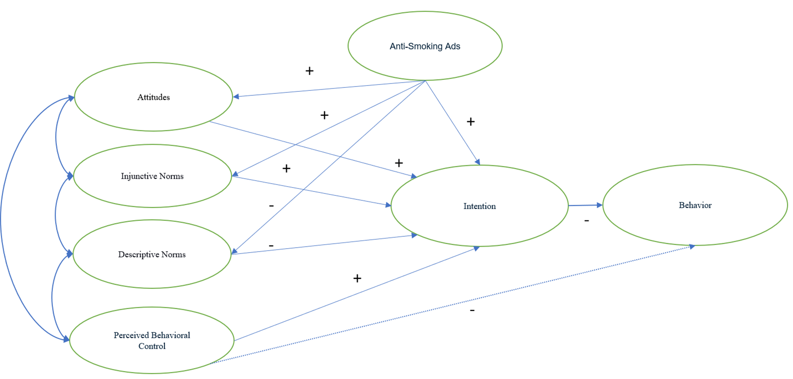
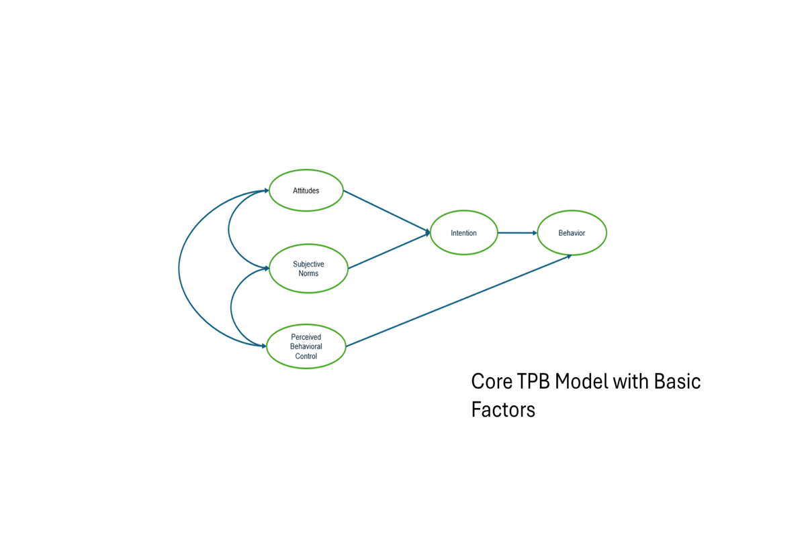

## Manuscript Overview

**Title**: *Predicting Adolescents’ Future Smoking Behavior through Anti-Smoking Ad Exposure*\
**Methodology**: Structural Equation Modeling (SEM) grounded in the Theory of Planned Behavior\
**Dataset**: Monitoring the Future (MTF) 2023 Survey\
**Sample**: \~14,000 U.S. adolescents (Grades 8 & 10)

------------------------------------------------------------------------

## Key Findings

-   Anti-smoking ads significantly influence adolescent beliefs through attitudes, norms, and perceived behavioral control

-   High internal consistency across TPB constructs (AVE \> 0.50, CR \> 0.89)

-   Confidence in Resisting Smoking emerged as the strongest predictor for Intention to Not Smoke for 5 Years (β = 0.817)

-   Strong Internal Consistency for all Latent Constructs (psychometrically strong and have great internal alignment).

    -   Attitudes (ATT): CR = 0.93, AVE = 0.82.
    -   Injunctive Norms (INJ): CR = 0.94, AVE = 0.59.
    -   Descriptive Norms (DES): CR = 0.89, AVE = 0.53.

-   Exposure to Anti-Smoking Ads→ Intention to Not Smoke in 5 Years: Unexpected negative β = -0.253

    -   Expected was greater exposure to anti-smoking advertisements is associated with a lower intention to not smoke for the next 5 years.
    -   Adolescents may exhibit message resistance or psychological reactance when they reject academic content perceived as controlling or become desensitized due to repeated exposure.

-   Confidence in Resisting Smoking → Smoking status: Unexpected positive β = 0.738

    -   Adolescents often overestimate their ability to resist smoking, resulting in overconfidence or cognitive dissonance.

#### *Demographic Insigths (Associations):*

+------------------------------------------------------+-------------------------------------------------------------------------------------+
| **Parental Presence** (vs. No Parents Cohabitating): | **Males** (vs. females):                                                            |
|                                                      |                                                                                     |
| -   Higher Exposure to Anti-Smoking Ads.             | -   Lower Risk Perceptions of Using Tobacco                                         |
|                                                      |                                                                                     |
| **Black Adolescents** (vs. White Adolescents):       | -   Lower Prevalence of Peers Using Tobacco **Grade level** (10th compared to 8th): |
|                                                      |                                                                                     |
| -   Lower Risk Perceptions of Using Tobacco.         | -   Higher Risk Perceptions of Using Tobacco.                                       |
|                                                      |                                                                                     |
| -   Lower Prevalence of Peers Using Tobacco          | -   Higher Prevalence of Peers Using Tobacco                                        |
|                                                      |                                                                                     |
| -   Lower Intention to Not Smoke for 5 Years         | -   Higher Intention to Not Smoke for 5 Years                                       |
|                                                      |                                                                                     |
| -   Higher Confidence in Resisting Smoking.          | -   Higher Smoking Status                                                           |
|                                                      |                                                                                     |
| **Hispanic Adolescents** (vs. White Adolescents):    | -   Lower Peer Disapproval of Smoking.                                              |
|                                                      |                                                                                     |
| -   Lower Risk Perceptions of Using Tobacco.         |                                                                                     |
|                                                      |                                                                                     |
| -   Lower Smoking Status.                            |                                                                                     |
+------------------------------------------------------+-------------------------------------------------------------------------------------+

------------------------------------------------------------------------

## SEM Constructs

The following psycho-cognitive variables were modeled using SEM:

| Construct | Items            | Description                             |
|-----------|------------------|-----------------------------------------|
| **ATT**   | att1, att2, att3 | Risk Perceptions of Using Tobacco       |
| **INJ**   | inj1, inj2       | Peer Disapproval of Smoking             |
| **DES**   | des1, des2       | Prevalence of Peers Using Tobacco       |
| **PBC**   | pbc              | Confidence in Resisting Smoking         |
| **INT**   | int              | Intention to Not Smoke in 5 Years       |
| **SMK**   | smk              | Smoking Status                          |
| **ADS**   | ads              | Exposure to Anti-Smoking Advertisements |

------------------------------------------------------------------------

## Theoretical Modeling

### Conceptual Model

### Hypothesized Model

------------------------------------------------------------------------

## Defense Presentation Slides

Summary of results and implications presented during thesis defense.

📄 [Download Defense Slides (PDF)](defense-presentation.pdf)

------------------------------------------------------------------------

## Interactive Dashboard

This interactive dashboard explores the **impact of anti-smoking ad exposure** and **predictive behavior constructs** across demographic subgroups.

<iframe src="https://mye-chow.shinyapps.io/rstudio/" width="100%" height="700px" frameborder="0">

</iframe>

------------------------------------------------------------------------

## Model Fit Indices for Confirmatory Factor Analysis

|                        |                      |           |                |
|------------------------|----------------------|-----------|----------------|
| Fit Index              | Value                | Threshold | Interpretation |
| Model χ² (df, p-value) | 1086.447 (58, 0.000) | \-        | Good Fit       |
| CFI                    | 0.975                | ≥ 0.95    | Excellent fit  |
| TLI                    | 0.952                | ≥ 0.95    | Excellent fit  |
| RMSEA                  | 0.036                | ≤ 0.05    | Excellent fit  |
| RMSEA 90% CI           | \[0.034, 0.038\]     | ≤ 0.08    | Excellent fit  |
| SRMR                   | 0.084                | ≤ 0.08    | Acceptable fit |

------------------------------------------------------------------------

## Notes

-   Dashboard powered by `RStudio`, hosted on [shinyapps.io](https://www.shinyapps.io) and Quarto website.
-   Full Manuscript: 📄 [Download Thesis Manuscript (PDF)](manuscript.pdf)
-   Complete Results: [Download the Results from Multivariate Statistical Analysis (Excel)](results.xlsx)
